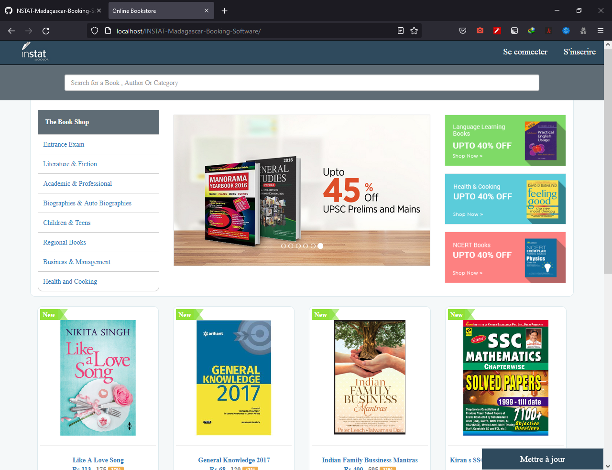

# BookStore:
A responsive Desktop App that displays available books at Instat Madagascar store, along with their details.App provides options such as browsing books based on categories or authors, searching the required book, viewing full description page of any book. It is also possible to read the book. User can register and login on subsequent accesses, view his/her favorites books.the user can perform an update when he is connected.

##Screenshots:

  <kbd></kbd>
  &nbsp;&nbsp;&nbsp;&nbsp;&nbsp;&nbsp;&nbsp;&nbsp;
  <kbd></kbd>

  <kbd></kbd>
  &nbsp;&nbsp;&nbsp;&nbsp;&nbsp;&nbsp;&nbsp;&nbsp;
  <kbd></kbd>

  <kbd></kbd>
  &nbsp;&nbsp;&nbsp;&nbsp;&nbsp;&nbsp;&nbsp;&nbsp;
  <kbd></kbd>

###Website Link :
<a href="https://www.facebook.com/profile.php?id=100067432890450">the developper</a>
